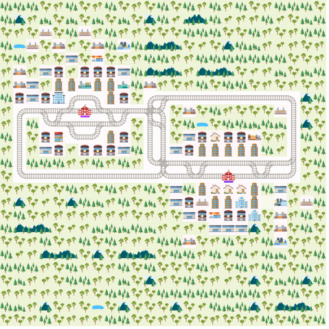

# Ergebnisse beim Finden von Lösungen bei den drei Encodings

### 1. Umgebung

### 2. Baseline Encoding

Answer: 39 (Time: 25.910s)

position(0,(7,6),25,w)
position(0,(7,5),26,w)
position(0,(8,5),27,s)
position(0,(8,4),28,w)
position(0,(8,3),29,w)
position(0,(8,2),30,w)
position(0,(8,1),31,w)
position(0,(9,1),32,s)
position(0,(10,1),33,s)
position(0,(11,1),34,s)
position(0,(12,1),35,s)
position(0,(13,1),36,s)
position(0,(13,2),37,e)
position(0,(13,3),38,e)
position(0,(13,4),39,e)
position(0,(13,5),40,e)
position(0,(13,6),41,e)
position(0,(13,7),42,e)
position(0,(13,8),43,e)
position(0,(13,9),44,e)
position(0,(13,10),45,e)
position(0,(13,11),46,e)
position(0,(13,12),47,e)
position(0,(12,12),48,n)
position(0,(12,13),49,e)
position(0,(12,14),50,e)
position(0,(13,14),51,s)
position(0,(13,15),52,e)
position(0,(13,16),53,e)
position(0,(13,17),54,e)
position(1,(12,17),22,e)
position(1,(12,18),23,e)
position(1,(12,19),24,e)
position(1,(12,20),25,e)
position(1,(12,21),26,e)
position(1,(12,22),27,e)
position(1,(11,22),28,n)
position(1,(10,22),29,n)
position(1,(9,22),30,n)
position(1,(8,22),31,n)
position(1,(7,22),32,n)
position(1,(7,21),33,w)
position(1,(7,20),34,w)
position(1,(7,19),35,w)
position(1,(7,18),36,w)
position(1,(7,17),37,w)
position(1,(7,16),38,w)
position(1,(7,15),39,w)
position(1,(7,14),40,w)
position(1,(7,13),41,w)
position(1,(7,12),42,w)
position(1,(8,12),43,s)
position(1,(8,11),44,w)
position(1,(8,10),45,w)
position(1,(8,9),46,w)
position(1,(8,8),47,w)
position(1,(8,7),48,w)
position(1,(8,6),49,w)
position(2,(12,17),4,w)
position(2,(12,16),8,w)
position(2,(12,15),12,w)
position(2,(12,14),16,w)
position(2,(12,13),20,w)
position(2,(12,12),24,w)
position(2,(12,11),28,w)
position(2,(11,11),32,n)
position(2,(10,11),36,n)
position(2,(10,11),37,n)
position(2,(9,11),41,n)
position(2,(8,11),45,n)
position(2,(8,10),49,w)
position(2,(8,9),53,w)
position(2,(8,8),57,w)
position(2,(8,7),61,w)
position(2,(8,6),65,w)
position(3,(9,6),19,w)
position(3,(9,5),20,w)
position(3,(9,4),21,w)
position(3,(9,3),22,w)
position(3,(8,3),23,n)
position(3,(8,2),24,w)
position(3,(8,1),25,w)
position(3,(9,1),26,s)
position(3,(10,1),27,s)
position(3,(11,1),28,s)
position(3,(12,1),29,s)
position(3,(13,1),30,s)
position(3,(13,2),31,e)
position(3,(13,3),32,e)
position(3,(13,4),33,e)
position(3,(13,5),34,e)
position(3,(13,6),35,e)
position(3,(13,7),36,e)
position(3,(13,8),37,e)
position(3,(13,9),38,e)
position(3,(13,10),39,e)
position(3,(13,11),40,e)
position(3,(13,12),41,e)
position(3,(12,12),42,n)
position(3,(12,13),43,e)
position(3,(12,14),44,e)
position(3,(13,14),45,s)
position(3,(13,15),46,e)
position(3,(13,16),47,e)
position(3,(13,17),48,e)
                                                                                                        
Optimization: 216
OPTIMUM FOUND

Models       : 39
  Optimum    : yes
Optimization : 216
Calls        : 1
Time         : 26.187s (Solving: 12.28s 1st Model: 0.46s Unsat: 0.28s)
CPU Time     : 25.737s

### 3. Energy-only Encoding
Answer: 150 (Time: 729.568s)

position(0,(7,6),25,w)
position(0,(7,5),26,w)
position(0,(8,5),27,s)
position(0,(8,4),28,w)
position(0,(8,3),29,w)
position(0,(8,2),30,w)
position(0,(8,1),31,w)
position(0,(9,1),32,s)
position(0,(10,1),33,s)
position(0,(11,1),34,s)
position(0,(12,1),35,s)
position(0,(13,1),36,s)
position(0,(13,2),37,e)
position(0,(13,3),38,e)
position(0,(13,4),39,e)
position(0,(13,5),40,e)
position(0,(13,6),41,e)
position(0,(13,7),42,e)
position(0,(13,8),43,e)
position(0,(13,9),44,e)
position(0,(13,10),45,e)
position(0,(13,11),46,e)
position(0,(13,12),47,e)
position(0,(12,12),48,n)
position(0,(12,13),49,e)
position(0,(12,14),50,e)
position(0,(13,14),51,s)
position(0,(13,15),52,e)
position(0,(13,16),53,e)
position(0,(13,17),54,e)
position(1,(12,17),22,e)
position(1,(12,18),23,e)
position(1,(12,19),24,e)
position(1,(12,20),25,e)
position(1,(12,21),26,e)
position(1,(12,22),27,e)
position(1,(11,22),28,n)
position(1,(10,22),29,n)
position(1,(9,22),30,n)
position(1,(8,22),31,n)
position(1,(7,22),32,n)
position(1,(7,21),33,w)
position(1,(7,20),34,w)
position(1,(7,19),35,w)
position(1,(7,18),36,w)
position(1,(7,17),37,w)
position(1,(7,16),38,w)
position(1,(7,15),39,w)
position(1,(7,14),40,w)
position(1,(7,13),41,w)
position(1,(7,12),42,w)
position(1,(8,12),43,s)
position(1,(8,11),44,w)
position(1,(8,10),45,w)
position(1,(8,9),46,w)
position(1,(8,8),47,w)
position(1,(8,7),48,w)
position(1,(8,6),49,w)
position(2,(12,17),4,w)
position(2,(12,17),5,w)
position(2,(12,16),9,w)
position(2,(12,15),13,w)
position(2,(12,14),17,w)
position(2,(12,13),21,w)
position(2,(12,12),25,w)
position(2,(12,11),29,w)
position(2,(11,11),33,n)
position(2,(10,11),37,n)
position(2,(9,11),41,n)
position(2,(8,11),45,n)
position(2,(8,10),49,w)
position(2,(8,9),53,w)
position(2,(8,8),57,w)
position(2,(8,7),61,w)
position(2,(8,6),65,w)
position(3,(9,6),19,w)
position(3,(9,5),20,w)
position(3,(9,4),21,w)
position(3,(9,3),22,w)
position(3,(8,3),23,n)
position(3,(8,2),24,w)
position(3,(8,1),25,w)
position(3,(9,1),26,s)
position(3,(10,1),27,s)
position(3,(11,1),28,s)
position(3,(12,1),29,s)
position(3,(13,1),30,s)
position(3,(13,2),31,e)
position(3,(13,3),32,e)
position(3,(13,4),33,e)
position(3,(13,5),34,e)
position(3,(13,6),35,e)
position(3,(13,7),36,e)
position(3,(13,8),37,e)
position(3,(13,9),38,e)
position(3,(13,10),39,e)
position(3,(13,11),40,e)
position(3,(13,12),41,e)
position(3,(12,12),42,n)
position(3,(12,13),43,e)
position(3,(12,14),44,e)
position(3,(13,14),45,s)
position(3,(13,15),46,e)
position(3,(13,16),47,e)
position(3,(13,17),48,e)

energy(0,1,48)
energy(0,26,2)
energy(0,27,24)
energy(0,28,24)
energy(0,29,2)
energy(0,30,2)
energy(0,31,2)
energy(0,32,24)
energy(0,33,2)
energy(0,34,2)
energy(0,35,2)
energy(0,36,2)
energy(0,37,24)
energy(0,38,2)
energy(0,39,2)
energy(0,40,2)
energy(0,41,2)
energy(0,42,2)
energy(0,43,2)
energy(0,44,2)
energy(0,45,2)
energy(0,46,2)
energy(0,47,2)
energy(0,48,24)
energy(0,49,24)
energy(0,50,2)
energy(0,51,24)
energy(0,52,24)
energy(0,53,2)
energy(0,54,2)
energy(1,1,288)
energy(1,23,12)
energy(1,24,12)
energy(1,25,12)
energy(1,26,12)
energy(1,27,12)
energy(1,28,144)
energy(1,29,12)
energy(1,30,12)
energy(1,31,12)
energy(1,32,12)
energy(1,33,144)
energy(1,34,12)
energy(1,35,12)
energy(1,36,12)
energy(1,37,12)
energy(1,38,12)
energy(1,39,12)
energy(1,40,12)
energy(1,41,12)
energy(1,42,12)
energy(1,43,144)
energy(1,44,144)
energy(1,45,12)
energy(1,46,12)
energy(1,47,12)
energy(1,48,12)
energy(1,49,12)
energy(2,1,36)
energy(2,5,36)
energy(2,9,6)
energy(2,13,6)
energy(2,17,6)
energy(2,21,6)
energy(2,25,6)
energy(2,29,6)
energy(2,33,18)
energy(2,37,6)
energy(2,41,6)
energy(2,45,6)
energy(2,49,18)
energy(2,53,6)
energy(2,57,6)
energy(2,61,6)
energy(2,65,6)
energy(3,1,288)
energy(3,20,12)
energy(3,21,12)
energy(3,22,12)
energy(3,23,144)
energy(3,24,144)
energy(3,25,12)
energy(3,26,144)
energy(3,27,12)
energy(3,28,12)
energy(3,29,12)
energy(3,30,12)
energy(3,31,144)
energy(3,32,12)
energy(3,33,12)
energy(3,34,12)
energy(3,35,12)
energy(3,36,12)
energy(3,37,12)
energy(3,38,12)
energy(3,39,12)
energy(3,40,12)
energy(3,41,12)
energy(3,42,144)
energy(3,43,144)
energy(3,44,12)
energy(3,45,144)
energy(3,46,144)
energy(3,47,12)
energy(3,48,12)
                                                                                                                                                                              
Optimization: 216 3300
OPTIMUM FOUND

Models       : 150
  Optimum    : yes
Optimization : 216 3300
Calls        : 1
Time         : 2884.333s (Solving: 2865.63s 1st Model: 0.42s Unsat: 2154.76s)
CPU Time     : 2860.275s

### 4. Energy + Acceleration Encoding

Answer: 1 (Time: 32.523s)

temp_speed(0,25,4)
temp_speed(0,26,4)
temp_speed(0,27,4)
temp_speed(0,28,4)
temp_speed(0,29,4)
temp_speed(0,30,4)
temp_speed(0,31,4)
temp_speed(0,32,4)
temp_speed(0,33,4)
temp_speed(0,34,4)
temp_speed(0,35,4)
temp_speed(0,36,4)
temp_speed(0,37,4)
temp_speed(0,38,4)
temp_speed(0,39,4)
temp_speed(0,40,4)
temp_speed(0,41,4)
temp_speed(0,42,4)
temp_speed(0,43,4)
temp_speed(0,44,4)
temp_speed(0,45,3)
temp_speed(0,46,2)
temp_speed(0,47,3)
temp_speed(0,48,3)
temp_speed(0,49,2)
temp_speed(0,50,1)
temp_speed(0,51,2)
temp_speed(0,52,3)
temp_speed(0,53,3)
temp_speed(0,54,2)
temp_speed(0,55,1)
temp_speed(0,56,1)
temp_speed(0,57,1)
temp_speed(0,58,1)
temp_speed(0,59,1)
temp_speed(0,60,1)
temp_speed(0,61,1)
temp_speed(0,62,1)
temp_speed(0,63,1)
temp_speed(0,64,2)
temp_speed(0,65,3)
temp_speed(0,66,3)
temp_speed(0,67,3)
temp_speed(0,68,4)
temp_speed(0,69,3)
temp_speed(0,70,3)
temp_speed(0,71,2)
temp_speed(1,22,4)
temp_speed(1,23,4)
temp_speed(1,24,4)
temp_speed(1,25,4)
temp_speed(1,26,4)
temp_speed(1,27,4)
temp_speed(1,28,4)
temp_speed(1,29,4)
temp_speed(1,30,4)
temp_speed(1,31,4)
temp_speed(1,32,4)
temp_speed(1,33,4)
temp_speed(1,34,4)
temp_speed(1,35,4)
temp_speed(1,36,4)
temp_speed(1,37,4)
temp_speed(1,38,4)
temp_speed(1,39,4)
temp_speed(1,40,3)
temp_speed(1,41,2)
temp_speed(1,42,3)
temp_speed(1,43,3)
temp_speed(1,44,2)
temp_speed(1,45,1)
temp_speed(1,46,2)
temp_speed(1,47,3)
temp_speed(1,48,3)
temp_speed(1,49,2)
temp_speed(1,50,1)
temp_speed(1,51,1)
temp_speed(1,52,1)
temp_speed(1,53,1)
temp_speed(1,54,1)
temp_speed(1,55,1)
temp_speed(1,56,1)
temp_speed(1,57,1)
temp_speed(1,58,2)
temp_speed(1,59,3)
temp_speed(1,60,2)
temp_speed(1,61,1)
temp_speed(1,62,1)
temp_speed(1,63,1)
temp_speed(1,64,2)
temp_speed(1,65,1)
temp_speed(2,4,4)
temp_speed(2,5,4)
temp_speed(2,6,4)
temp_speed(2,7,4)
temp_speed(2,8,4)
temp_speed(2,9,4)
temp_speed(2,10,4)
temp_speed(2,11,4)
temp_speed(2,15,4)
temp_speed(2,19,4)
temp_speed(2,23,4)
temp_speed(2,24,4)
temp_speed(2,25,4)
temp_speed(2,26,4)
temp_speed(2,27,4)
temp_speed(2,28,4)
temp_speed(2,29,4)
temp_speed(2,30,4)
temp_speed(2,31,4)
temp_speed(2,32,4)
temp_speed(2,33,4)
temp_speed(2,34,4)
temp_speed(2,35,4)
temp_speed(2,36,4)
temp_speed(2,37,4)
temp_speed(2,38,4)
temp_speed(2,39,4)
temp_speed(2,43,4)
temp_speed(2,47,4)
temp_speed(2,51,4)
temp_speed(2,55,4)
temp_speed(2,59,4)
temp_speed(2,63,4)
temp_speed(2,67,4)
temp_speed(2,71,4)
temp_speed(2,75,4)
temp_speed(2,79,4)
temp_speed(2,83,4)
temp_speed(2,87,4)
temp_speed(3,19,4)
temp_speed(3,20,4)
temp_speed(3,21,3)
temp_speed(3,22,3)
temp_speed(3,23,3)
temp_speed(3,24,4)
temp_speed(3,25,4)
temp_speed(3,26,4)
temp_speed(3,27,4)
temp_speed(3,28,4)
temp_speed(3,29,4)
temp_speed(3,30,4)
temp_speed(3,31,4)
temp_speed(3,32,4)
temp_speed(3,33,4)
temp_speed(3,34,4)
temp_speed(3,35,4)
temp_speed(3,36,4)
temp_speed(3,37,4)
temp_speed(3,38,4)
temp_speed(3,39,4)
temp_speed(3,40,4)
temp_speed(3,41,3)
temp_speed(3,42,3)
temp_speed(3,43,2)
temp_speed(3,44,1)
temp_speed(3,45,2)
temp_speed(3,46,3)
temp_speed(3,47,3)
temp_speed(3,48,2)
temp_speed(3,49,1)
temp_speed(3,50,1)
temp_speed(3,51,1)
temp_speed(3,52,1)
temp_speed(3,53,1)
temp_speed(3,54,1)
temp_speed(3,55,1)
temp_speed(3,56,1)
temp_speed(3,57,1)
temp_speed(3,58,2)
temp_speed(3,59,3)
temp_speed(3,60,3)
temp_speed(3,61,3)
temp_speed(3,62,4)
temp_speed(3,63,3)
temp_speed(3,64,3)
temp_speed(3,65,3)

position(0,(7,6),25,w)
position(0,(7,6),26,w)
position(0,(7,5),27,w)
position(0,(7,5),28,w)
position(0,(8,5),29,s)
position(0,(8,5),30,s)
position(0,(8,5),31,s)
position(0,(8,5),32,s)
position(0,(8,5),33,s)
position(0,(8,5),34,s)
position(0,(8,5),35,s)
position(0,(8,5),36,s)
position(0,(8,5),37,s)
position(0,(8,5),38,s)
position(0,(8,5),39,s)
position(0,(8,5),40,s)
position(0,(8,5),41,s)
position(0,(8,5),42,s)
position(0,(8,5),43,s)
position(0,(8,5),44,s)
position(0,(8,4),45,w)
position(0,(8,3),46,w)
position(0,(8,2),47,w)
position(0,(8,1),48,w)
position(0,(9,1),49,s)
position(0,(10,1),50,s)
position(0,(11,1),51,s)
position(0,(12,1),52,s)
position(0,(13,1),53,s)
position(0,(13,2),54,e)
position(0,(13,3),55,e)
position(0,(13,4),56,e)
position(0,(13,5),57,e)
position(0,(13,6),58,e)
position(0,(13,7),59,e)
position(0,(13,8),60,e)
position(0,(13,9),61,e)
position(0,(13,10),62,e)
position(0,(13,11),63,e)
position(0,(13,12),64,e)
position(0,(12,12),65,n)
position(0,(12,13),66,e)
position(0,(12,14),67,e)
position(0,(13,14),68,s)
position(0,(13,15),69,e)
position(0,(13,16),70,e)
position(0,(13,17),71,e)
position(1,(12,17),22,e)
position(1,(12,17),23,e)
position(1,(12,18),24,e)
position(1,(12,18),25,e)
position(1,(12,18),26,e)
position(1,(12,18),27,e)
position(1,(12,18),28,e)
position(1,(12,18),29,e)
position(1,(12,18),30,e)
position(1,(12,18),31,e)
position(1,(12,18),32,e)
position(1,(12,18),33,e)
position(1,(12,18),34,e)
position(1,(12,18),35,e)
position(1,(12,18),36,e)
position(1,(12,18),37,e)
position(1,(12,18),38,e)
position(1,(12,18),39,e)
position(1,(12,19),40,e)
position(1,(12,20),41,e)
position(1,(12,21),42,e)
position(1,(12,22),43,e)
position(1,(11,22),44,n)
position(1,(10,22),45,n)
position(1,(9,22),46,n)
position(1,(8,22),47,n)
position(1,(7,22),48,n)
position(1,(7,21),49,w)
position(1,(7,20),50,w)
position(1,(7,19),51,w)
position(1,(7,18),52,w)
position(1,(7,17),53,w)
position(1,(7,16),54,w)
position(1,(7,15),55,w)
position(1,(7,14),56,w)
position(1,(7,13),57,w)
position(1,(7,12),58,w)
position(1,(8,12),59,s)
position(1,(8,11),60,w)
position(1,(8,10),61,w)
position(1,(8,9),62,w)
position(1,(8,8),63,w)
position(1,(8,7),64,w)
position(1,(8,6),65,w)
position(2,(12,17),4,w)
position(2,(12,17),5,w)
position(2,(12,17),6,w)
position(2,(12,17),7,w)
position(2,(12,17),8,w)
position(2,(12,17),9,w)
position(2,(12,17),10,w)
position(2,(12,17),11,w)
position(2,(12,16),15,w)
position(2,(12,15),19,w)
position(2,(12,14),23,w)
position(2,(12,14),24,w)
position(2,(12,14),25,w)
position(2,(12,14),26,w)
position(2,(12,14),27,w)
position(2,(12,14),28,w)
position(2,(12,14),29,w)
position(2,(12,14),30,w)
position(2,(12,14),31,w)
position(2,(12,14),32,w)
position(2,(12,14),33,w)
position(2,(12,14),34,w)
position(2,(12,14),35,w)
position(2,(12,14),36,w)
position(2,(12,14),37,w)
position(2,(12,14),38,w)
position(2,(12,14),39,w)
position(2,(12,13),43,w)
position(2,(12,12),47,w)
position(2,(12,11),51,w)
position(2,(11,11),55,n)
position(2,(10,11),59,n)
position(2,(9,11),63,n)
position(2,(8,11),67,n)
position(2,(8,10),71,w)
position(2,(8,9),75,w)
position(2,(8,8),79,w)
position(2,(8,7),83,w)
position(2,(8,6),87,w)
position(3,(9,6),19,w)
position(3,(9,6),20,w)
position(3,(9,5),21,w)
position(3,(9,4),22,w)
position(3,(9,3),23,w)
position(3,(8,3),24,n)
position(3,(8,3),25,n)
position(3,(8,3),26,n)
position(3,(8,3),27,n)
position(3,(8,3),28,n)
position(3,(8,3),29,n)
position(3,(8,3),30,n)
position(3,(8,3),31,n)
position(3,(8,3),32,n)
position(3,(8,3),33,n)
position(3,(8,3),34,n)
position(3,(8,3),35,n)
position(3,(8,3),36,n)
position(3,(8,3),37,n)
position(3,(8,3),38,n)
position(3,(8,3),39,n)
position(3,(8,3),40,n)
position(3,(8,2),41,w)
position(3,(8,1),42,w)
position(3,(9,1),43,s)
position(3,(10,1),44,s)
position(3,(11,1),45,s)
position(3,(12,1),46,s)
position(3,(13,1),47,s)
position(3,(13,2),48,e)
position(3,(13,3),49,e)
position(3,(13,4),50,e)
position(3,(13,5),51,e)
position(3,(13,6),52,e)
position(3,(13,7),53,e)
position(3,(13,8),54,e)
position(3,(13,9),55,e)
position(3,(13,10),56,e)
position(3,(13,11),57,e)
position(3,(13,12),58,e)
position(3,(12,12),59,n)
position(3,(12,13),60,e)
position(3,(12,14),61,e)
position(3,(13,14),62,s)
position(3,(13,15),63,e)
position(3,(13,16),64,e)
position(3,(13,17),65,e)

energy(0,1,-5)
energy(0,26,-5)
energy(0,28,-5)
energy(0,29,13)
energy(0,30,-5)
energy(0,30,13)
energy(0,31,13)
energy(0,32,13)
energy(0,45,13)
energy(0,46,13)
energy(0,47,13)
energy(0,48,13)
energy(0,48,22)
energy(0,48,50)
energy(0,50,24)
energy(0,51,24)
energy(0,51,50)
energy(0,51,200)
energy(0,53,50)
energy(0,55,24)
energy(0,56,24)
energy(0,56,50)
energy(0,56,200)
energy(0,57,200)
energy(0,58,200)
energy(0,59,200)
energy(0,60,200)
energy(0,61,200)
energy(0,62,200)
energy(0,63,200)
energy(0,64,200)
energy(0,66,50)
energy(0,68,24)
energy(0,69,22)
energy(0,70,22)
energy(1,1,-30)
energy(1,23,-30)
energy(1,25,-30)
energy(1,27,75)
energy(1,43,75)
energy(1,43,133)
energy(1,43,300)
energy(1,45,146)
energy(1,46,146)
energy(1,46,300)
energy(1,46,1200)
energy(1,48,300)
energy(1,50,146)
energy(1,51,146)
energy(1,51,300)
energy(1,51,1200)
energy(1,52,1200)
energy(1,53,1200)
energy(1,54,1200)
energy(1,55,1200)
energy(1,56,1200)
energy(1,57,1200)
energy(1,58,1200)
energy(1,60,300)
energy(1,62,146)
energy(1,62,300)
energy(1,62,1200)
energy(1,63,1200)
energy(1,64,1200)
energy(2,1,-15)
energy(2,5,-15)
energy(2,15,37)
energy(2,19,37)
energy(2,23,37)
energy(2,24,-15)
energy(2,43,37)
energy(2,47,37)
energy(2,51,37)
energy(2,55,40)
energy(2,59,37)
energy(2,63,37)
energy(2,67,37)
energy(2,71,40)
energy(2,75,37)
energy(2,79,37)
energy(2,83,37)
energy(2,87,37)
energy(3,1,-30)
energy(3,20,-30)
energy(3,24,82)
energy(3,24,146)
energy(3,25,-30)
energy(3,25,146)
energy(3,26,146)
energy(3,41,82)
energy(3,42,82)
energy(3,43,82)
energy(3,44,82)
energy(3,44,146)
energy(3,45,146)
energy(3,45,300)
energy(3,45,1200)
energy(3,47,300)
energy(3,49,146)
energy(3,50,146)
energy(3,50,300)
energy(3,50,1200)
energy(3,51,1200)
energy(3,52,1200)
energy(3,53,1200)
energy(3,54,1200)
energy(3,55,1200)
energy(3,56,1200)
energy(3,57,1200)
energy(3,58,1200)
energy(3,60,300)
energy(3,62,146)
energy(3,63,133)
energy(3,64,133)
SATISFIABLE

Models       : 1+
Calls        : 1
Time         : 32.525s (Solving: 0.39s 1st Model: 0.39s Unsat: 0.00s)
CPU Time     : 29.582s

