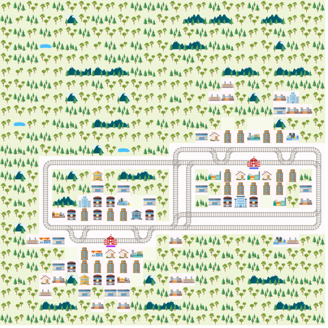

# Ergebnisse beim Finden von Lösungen bei den drei Encodings

### 1. Umgebung

### 2. Baseline Encoding
Models       : 49
  Optimum    : yes
Optimization : 508
Calls        : 1
Time         : 553.860s (Solving: 537.49s 1st Model: 0.37s Unsat: 517.49s)
CPU Time     : 553.477s

Answer: 49 (Time: 36.367s)
position(0,(11,19),126,w) position(1,(17,8),78,e) position(2,(11,19),74,e) position(3,(17,8),4,w) position(4,(17,8),23,w) position(0,(11,18),127,w) position(1,(17,9),79,e) position(2,(11,20),75,e) position(3,(17,7),8,w) position(4,(17,7),24,w) position(4,(17,6),25,w) position(3,(17,6),12,w) position(2,(11,21),76,e) position(1,(17,10),80,e) position(0,(11,17),128,w) position(0,(12,17),129,s) position(1,(17,11),81,e) position(2,(11,22),77,e) position(3,(18,6),16,s) position(4,(17,5),26,w) position(4,(17,4),27,w) position(3,(18,5),20,w) position(2,(11,23),78,e) position(1,(17,12),82,e) position(0,(12,16),130,w) position(0,(12,15),131,w) position(1,(17,13),83,e) position(2,(11,24),79,e) position(3,(18,5),21,w) position(4,(17,3),28,w) position(4,(16,3),29,n) position(3,(18,5),22,w) position(2,(12,24),80,s) position(1,(17,14),84,e) position(0,(12,14),132,w) position(0,(13,14),133,s) position(1,(16,14),85,n) position(2,(13,24),81,s) position(3,(18,5),23,w) position(4,(15,3),30,n) position(4,(14,3),31,n) position(3,(17,5),27,n) position(2,(14,24),82,s) position(1,(15,14),86,n) position(0,(14,14),134,s) position(0,(15,14),135,s) position(1,(14,14),87,n) position(2,(15,24),83,s) position(3,(17,4),31,w) position(4,(13,3),32,n) position(4,(12,3),33,n) position(3,(17,3),35,w) position(2,(16,24),84,s) position(1,(13,14),88,n) position(0,(16,14),136,s) position(0,(17,14),137,s) position(1,(12,14),89,n) position(2,(16,23),85,w) position(3,(16,3),39,n) position(4,(12,4),34,e) position(4,(12,5),35,e) position(3,(15,3),43,n) position(2,(16,22),86,w) position(1,(12,15),90,e) position(0,(17,13),138,w) position(0,(17,12),139,w) position(1,(12,16),91,e) position(2,(16,21),87,w) position(3,(14,3),47,n) position(4,(12,6),36,e) position(4,(12,7),37,e) position(3,(13,3),51,n) position(2,(16,20),88,w) position(1,(12,17),92,e) position(0,(17,11),140,w) position(0,(18,11),141,s) position(1,(12,18),93,e) position(2,(16,19),89,w) position(3,(12,3),55,n) position(4,(12,8),38,e) position(4,(12,9),39,e) position(3,(12,4),59,e) position(2,(16,18),90,w) position(1,(12,19),94,e) position(0,(18,10),142,w) position(0,(18,9),143,w) position(2,(16,17),91,w) position(3,(12,5),63,e) position(4,(12,10),40,e) position(4,(12,11),41,e) position(3,(12,6),67,e) position(2,(16,16),92,w) position(0,(18,8),144,w) position(2,(16,15),93,w) position(3,(12,7),71,e) position(4,(12,12),42,e) position(4,(12,13),43,e) position(3,(12,8),75,e) position(2,(16,14),94,w) position(2,(16,13),95,w) position(3,(12,9),79,e) position(4,(12,14),44,e) position(4,(12,15),45,e) position(3,(12,10),83,e) position(2,(17,13),96,s) position(2,(17,12),97,w) position(3,(12,11),87,e) position(4,(12,16),46,e) position(4,(12,17),47,e) position(3,(12,12),91,e) position(2,(17,11),98,w) position(2,(18,11),99,s) position(3,(12,13),95,e) position(4,(12,18),48,e) position(4,(12,19),49,e) position(3,(12,14),99,e) position(2,(18,10),100,w) position(2,(18,9),101,w) position(3,(12,15),103,e) position(3,(12,16),107,e) position(2,(18,8),102,w) position(3,(12,17),111,e) position(3,(12,18),115,e) position(3,(12,19),119,e)
Optimization: 508

### 3. Energy-only Encoding
### 4. Energy + Acceleration Encoding